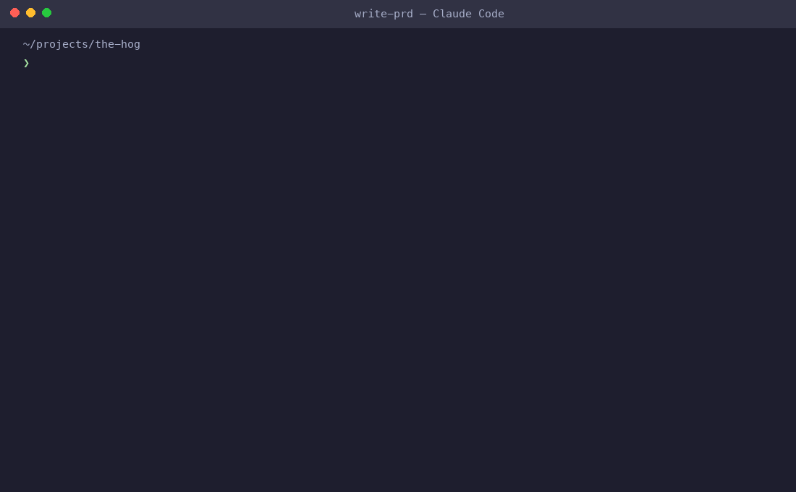

# write-prd

> A Claude Code skill for writing world-class PRDs + technical specs — built for startup engineers and PMs who need to propose features to CTO/CEO before building.




---

## What it does

Invoke `/write-prd` and Claude will:

1. **Interview you** — feature idea, existing system, primary user, strategic context, scope, what's already decided
2. **Research** — competitive landscape, technical patterns at similar companies, common gotchas
3. **Write a full document** — following a template derived from how teams at Google, Amazon, Figma, and OpenAI write specs

The output is a markdown doc you can drop in front of your CTO and defend at the detail level.

---

## Install

**One-liner (Claude Code):**

```bash
curl -fsSL https://raw.githubusercontent.com/FisherXZ/write-prd/main/install.sh | bash
```

**Manual:**

```bash
mkdir -p ~/.claude/skills/write-prd
curl -fsSL https://raw.githubusercontent.com/FisherXZ/write-prd/main/SKILL.md \
  -o ~/.claude/skills/write-prd/SKILL.md
```

**Multi-agent (add to your project repo):**

```bash
curl -fsSL https://raw.githubusercontent.com/FisherXZ/write-prd/main/install.sh | bash --all
```

---

## Platform support

| Agent | Install path |
|-------|-------------|
| Claude Code | `~/.claude/skills/write-prd/` |
| Cursor | `.cursor/skills/write-prd/` |
| Gemini CLI | `.gemini/skills/write-prd/` |
| OpenCode | `.opencode/skills/write-prd/` |
| Codex | `.codex/skills/write-prd/` |
| Kiro | `.kiro/skills/write-prd/` |

Pre-built directories for each platform are included in this repo — clone and go.

---

## Usage

```
/write-prd
```

Or just describe what you want to build. The skill auto-triggers when you ask to spec out, write up, or formalize a feature before building it — even if you don't say "PRD."

---

## Document structure

Every output follows this template:

| Section | What it contains |
|---------|-----------------|
| **TL;DR** | 2–4 sentences for a busy exec |
| **User Narrative** | Named user walking the feature end-to-end |
| **Why This Feature** | Competitive context, product thesis, leverage on existing investment |
| **Non-Goals** | Explicit scope constraints |
| **Scope** | Entry points, schema changes, data flow pseudocode |
| **Core Workflow** | Step-by-step with edge cases at every step |
| **Technical Architecture** | Component table, data model, design decisions (Problem → Decision → Why) |
| **Definition of Done** | Numbered checklist |
| **Open Questions** | Review hooks with your recommendation + tradeoff |

---

## Example output

Below is an excerpt from a real PRD generated by this skill ([full doc](examples/linkedin-inbox-sync.md)):

```markdown
# LinkedIn Message Inbox Sync — Feature Spec

## 1. TL;DR

Ingest a user's LinkedIn message history into The Hog so SDRs can read, search, 
and reply to LinkedIn DMs without leaving the app. Replies sent from The Hog are 
posted back to LinkedIn via OAuth + Messaging API and automatically logged as lead 
activity. V1 targets read + reply parity; sending net-new cold outreach from The 
Hog is V2.

## 2. User Narrative

Marcus is an SDR at a growth-stage B2B SaaS company. He runs outbound on LinkedIn 
every day — 20–30 new connection requests, follow-up messages to warm prospects, 
replies to inbound DMs from people who saw his content. Every afternoon he switches 
between The Hog (where his leads live) and LinkedIn (where the conversation history 
lives). He's constantly copy-pasting context.

Today Marcus opens The Hog. Under each lead in his pipeline he sees a new **Messages** 
tab. It shows the full LinkedIn DM thread with that person...

## 3. Why This Feature

### 3.1 Competitive context
Every mature sales engagement platform ships native LinkedIn inbox integration: 
Salesloft and Outreach both surface LinkedIn DMs in the activity timeline. Apollo.io 
shows LinkedIn conversation history inline on contact records...

## 7.3 Critical design decisions

**Per-user OAuth, not per-org**
- **Problem:** LinkedIn's API terms prohibit shared credentials.
- **Decision:** Each user connects their own LinkedIn account.
- **Why:** Only viable option under LinkedIn's API terms. Aligns with industry 
  practice (Salesloft, Outreach both use per-rep OAuth).
```

---

## Principles baked in

- **Problem before solution** — 40–60% of the doc is *why*, for whom, and why now
- **Proof of work** — competitive research, user narrative, data baselines
- **Defensible decisions** — every non-obvious choice: Problem → Decision → Why
- **Non-goals are mandatory** — the section most commonly skipped; most reliably prevents scope creep
- **Edge cases in every step** — never happy path only

---

## Who this is for

- Engineers at startups writing specs for CTO/CEO review before sprinting
- PMs turning rough ideas into plans they can hand off to engineers
- Anyone who needs to defend a technical choice to a non-technical stakeholder

---

## Contributing

PRs welcome. See [CONTRIBUTING.md](CONTRIBUTING.md).

---

Built with [Claude Code](https://claude.ai/code).
